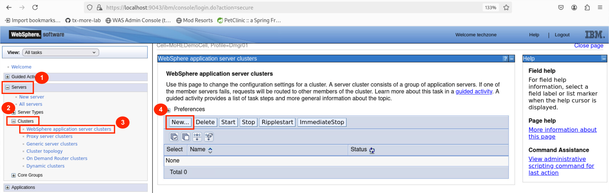
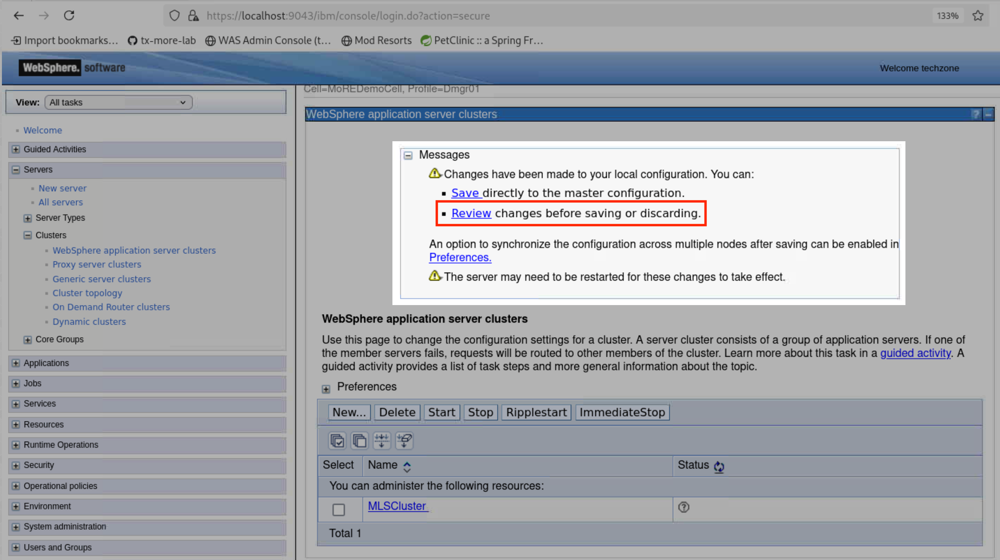
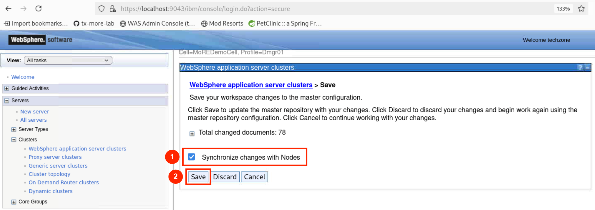
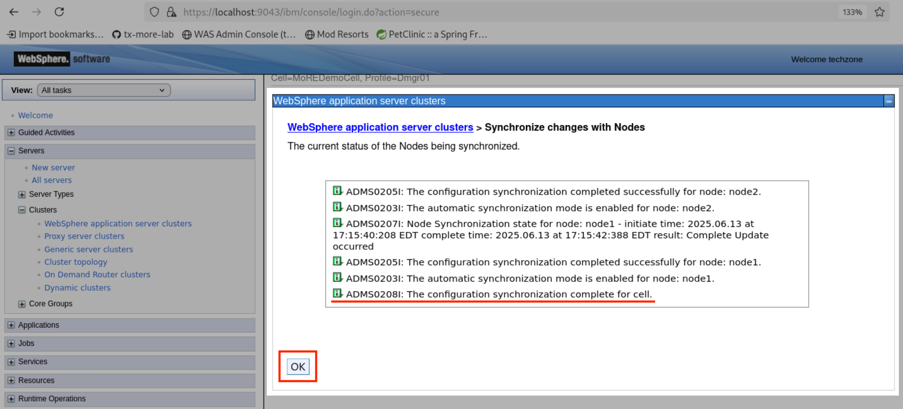
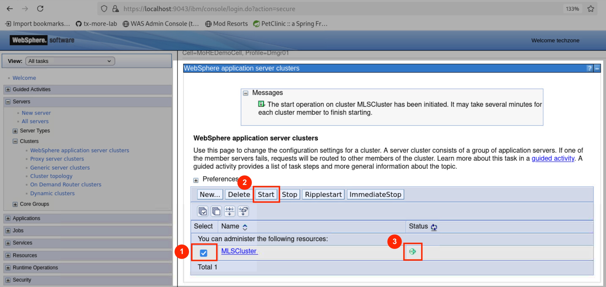

# IBM Modernized Runtime Extension for Java Hands-On Lab

<details>
<summary>Table of Contents</summary>

1. [Introduction](#introduction)  
   1.1 [About this hands-on lab](#about-this-hands-on-lab)

2. [Getting started](#getting-started)  
   2.1 [Lab environment overview](#lab-environment-overview)  
   2.2 [Cloning the lab repository](#cloning-the-lab-repository)  
   2.3 [Starting WebSphere and IHS servers](#starting-websphere-and-ihs-servers) 

3. [Creating a static managed Liberty server cluster](#creating-a-static-managed-liberty-server-cluster)  
   3.1 [Option 1: Using the administrative console](#option-1-using-the-administrative-console)  
   3.2 [Option 2: Using administrative scripting](#option-2-using-administrative-scripting)  

4. [Module 1: Deploying a Jakarta EE 10 application](module1/README.md)

5. [Module 2: Deploying a Spring Framework 6.x application](module2/README.md)

6. [Troubleshooting](#troubleshooting)  
   6.1 [Resetting the lab environment](#resetting-the-lab-environment)

</details>

# Introduction

[IBM Modernized Runtime Extension for Java](https://www.ibm.com/docs/en/more) (MoRE) is an extension of WebSphere® Application Server Network Deployment (ND) 9.0.5 that enables you to run and manage Liberty servers from the traditional WebSphere environment. With MoRE, Liberty servers can be configured, clustered, and administered using familiar tools like the administrative console and wsadmin scripting.

## About this hands-on lab

In this interactive, hands-on lab, you'll explore the cutting-edge capabilities of WebSphere Application Server and MoRE—tools designed to supercharge your modernization journey. One of the standout features you'll experience is the powerful new ability to create and manage static clusters of managed Liberty application servers, bringing scalability and control to a whole new level.

Through guided modules, you'll deploy modern Jakarta EE and Spring Boot applications to a Liberty cluster, using the WebSphere Administrative Console and/or automation with wsadmin scripts. Whether you're modernizing legacy systems or building cloud-native apps, this lab is your launchpad into the next generation of enterprise application management.

---
# Getting started

This section guides you through the initial setup of the lab environment. Perform all tasks from the student virtual machine.

## Lab environment overview

The lab environment is preinstalled with the following packages:

* WebSphere Application Server Network Deployment (ND), version 9.0.5.24, running on Java SE 8

    * Modernized Runtime Extension for Java (MoRE), version 1.0.0.1

    * IBM HTTP Server (IHS) and Web Server Plug-ins for WebSphere Application Server

* WebSphere Liberty, version 24.0.0.6, running on Java SE 17

In addition, the environment is preconfigured with the following profiles and server instances:

* A Deployment Manager (`dmgr`), which serves as the central controller for the WebSphere cell.

* Two managed nodes, `node1` and `node2`, both federated into the same cell as the `dmgr`.

* A preconfigured web server, `webserver1`, running on `node2`, which listens on ports `7777` (HTTP) and `8888` (HTTPS). This server forwards incoming requests to applications running on the Liberty cluster via IHS and the WebSphere Plugin, allowing external access without directly exposing Liberty server ports.

All components are installed under `/home/techzone/IBM` on the student virtual machine.

## Cloning the lab repository

Open a command-line terminal and run the following commands to clone the lab repository to your environment:

```sh
cd /home/techzone/Student

git clone https://github.com/Emily-Jiang/tx-more-lab.git
cd tx-more-lab
```

## Starting WebSphere and IHS servers

The [`scripts/start-was-servers.sh`](scripts/start-was-servers.sh) script starts all preconfigured WebSphere components required for the lab, including the Deployment Manager, both node agents, and `webserver1`.

Run the following command to execute the script:

```sh
./scripts/start-was-servers.sh
```
After the script completes, the message `All servers have been started!` is displayed.

---
# Creating a static managed Liberty server cluster

This section guides you through the process of creating a static managed Liberty server cluster.

You can use either of the following methods to complete this task:
* If you prefer a visual, step-by-step experience, continue with [Option 1: Using the administrative console](#option-1-using-the-administrative-console).
* If you prefer automation or scripting, skip ahead to [Option 2: Using administrative scripting](#option-2-using-administrative-scripting).

## Option 1: Using the administrative console

1. Launch the **WAS Admin Console** by selecting it from your browser bookmarks or navigating to the https://localhost:9043/ibm/console URL.

   Log in using the following credentials:
   * User ID: `techzone`
   * Password: `IBMDem0s!` (Note that the zero is used instead of the letter "O")

2. Navigate to **Servers** &rarr; **Clusters** &rarr; **WebSphere application server clusters**. Click **New...** to create a new cluster.

   

3. On **Step 1**, set **Cluster name** to `MLSCluster`. Leave the other fields as default. Click **Next**.

4. On **Step 2**, configure the first cluster member:

   * **Member Name**: `libertyServer`
   * **Select node**: `node1`
   * **Select basis for first cluster member**: choose **Create the member using an application server template**, then select `default-managed-liberty-server` from the dropdown

   Leave all other settings as default. Click **Next**.

5. On **Step 3**, configure the second cluster member:

   * **Member Name**: `libertyServer`
   * **Select node**: `node2`

   Leave the other fields as default. Click **Add Member**, then click **Next**.

6. On **Step 4**, review the configuration summary and click **Finish**.

7. Click <ins>Review</ins>.

   

8. Select **Synchronize changes with Nodes**, then click **Save** to apply the configuration and synchronize with both nodes.

   

9. After synchronization completes, click **OK**.

   

10. Return to **Servers** &rarr; **Clusters** &rarr; **WebSphere application server clusters**. Locate <ins>MLSCluster</ins> in the list and ensure it is present. Check the box next to it, then click **Start** to initiate the cluster. Wait until the status displays a green arrow, indicating that it is running.

    

## Option 2: Using administrative scripting

Run the following command to create and start the cluster using the provided Jython script [`createMLSCluster.py`](scripts/createMLSCluster.py):

```sh
/home/techzone/IBM/WebSphere/AppServer/profiles/Dmgr01/bin/wsadmin.sh \
  -lang jython -user techzone -password IBMDem0s! \
  -f /home/techzone/Student/tx-more-lab/scripts/createMLSCluster.py
```

The script performs the following actions:

* Creates the static cluster named `MLSCluster`
* Adds one managed Liberty server on each node
* Synchronizes the configuration across nodes
* Starts the Liberty cluster

When the cluster starts successfully, the message `!!!Successfully started the cluster!!!` is displayed.

---
# Next steps

Proceed to [Module 1](module1/README.md) to deploy a Java 17 and Jakarta EE 10 application to the managed Liberty cluster.

---
# Troubleshooting

This section provides guidance on troubleshooting common issues during the lab.

## Resetting the lab environment

If you encounter problems or want to start the lab from scratch, you can reset the environment to its original state by running:

```sh
/home/techzone/Student/tx-more-lab/scripts/reset-lab-env.sh
```

To remove the cloned lab repository, run:

```sh
cd /home/techzone/Student
rm -rf tx-more-lab
```

This ensures you’re starting from a clean workspace.
