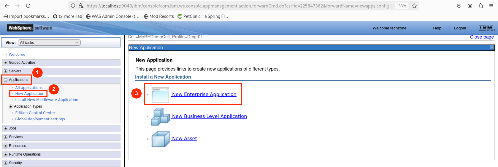
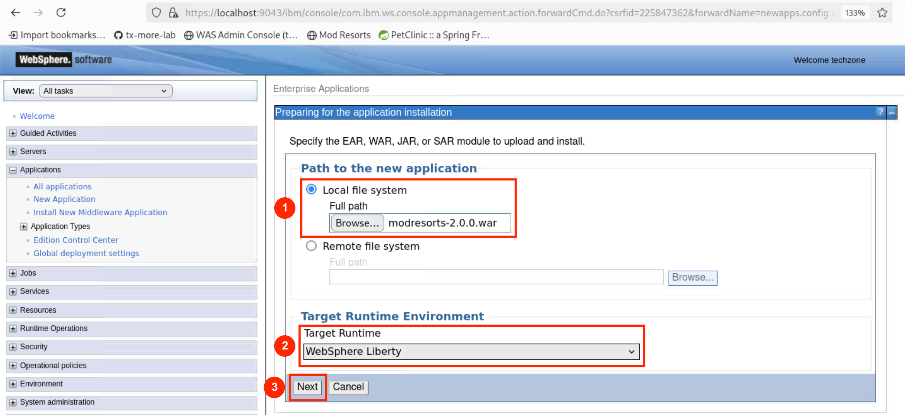
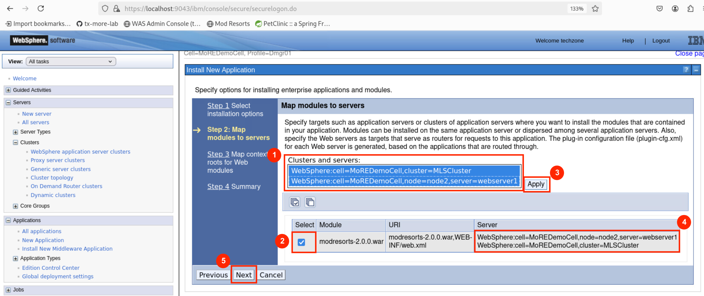
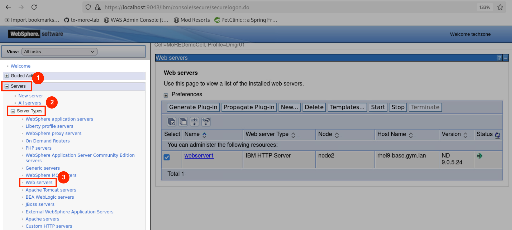

# Deploying a Jakarta EE 10 application

This section guides you through deploying a Jakarta EE 10 application, running on Java 17, to a Liberty cluster managed by WebSphere Application Server using MoRE. 

As with earlier tasks, you can choose to use either the graphical administrative console or a scripting-based approach.

## About the ModResorts application

In this module, you’ll work with the ModResorts application, a sample web application originally developed for IBM WebSphere Application Server 9. It has since been migrated to Liberty, upgraded from Java 8 to Java 17, and updated to use technologies from the Jakarta EE 10 Core Profile. You can find the source code [here](https://github.com/IBM/sample-app-mod).

## Building the application WAR file

Before deploying the application, build it to generate the application WAR file:

```sh
cd /home/techzone/Student/tx-more-lab/module1

cd modresorts
mvn clean package
```

The WAR file `modresorts-2.0.0.war` is created in the project's `target` directory and will be used for deployment to the Liberty cluster.

## Option 1: Using the administrative console

This section walks you through deploying the application using the administrative console.

If you prefer to use a script, skip ahead to [Option 2: Using administrative scripting](#option-2-using-administrative-scripting).

### Installing the application WAR file

1. Launch the **WAS Admin Console** by selecting it from your browser bookmarks or navigating to the https://localhost:9043/ibm/console URL.

2. Go to **Applications** &rarr; **New Application** &rarr; <ins>New Enterprise Application</ins>.

   

3. In the installation panel:

   * Under **Path to new application**, select **Local file system** and choose the WAR file located at `/home/techzone/Student/tx-more-lab/module1/modresorts/target/modresorts-2.0.0.war`
   * Set **Target Runtime Environment** to `WebSphere Liberty`
   
   Click **Next** and wait for the application to upload.

   

4. Choose **Fast Path** and click **Next**.

5. Leave **Step 1** unchanged and click **Next**.

6. On **Step 2**, map the application module:

   * Under **Cluster and servers**, select both `MLSCluster` and `webserver1` by holding **Shift** or dragging between options.

   * Check the box next to `modresorts-2.0.0.war` and click **Apply**.

   * Confirm that both `MLSCluster` and `webserver1` are now listed under the **Server** column for the `modresorts-2.0.0.war` module.
   
   Click **Next**.

   

7. On **Step 3**, confirm that the **Context Root** is set to `/resorts` and click **Next**.

8. On **Step 4**, review the installation summary and click **Finish**.

9. After the installation completes, click <ins>Review</ins>. 
   
   Select **Synchronize changes with Nodes**, and click **Save**. Click **OK** when synchronization is complete.

### Generating and propagating the web server plug-in

1. Go to **Servers** &rarr; **Server Types** &rarr; **Web servers**.
   
   

2. Select `webserver1` and click **Generate Plug-in**.

3. Select `webserver1` again and click **Propagate Plug-in**.

After plug-in generation and propagation are complete, verify that the application is running by following the steps in [Checking out the application](#checking-out-the-application).

## Option 2: Using administrative scripting

This section walks you through deploying the application using the administrative console.

Run the following command to deploy the application using the provided Jython  script [`deployModResorts.py`](deployModResorts.py):

```sh
/home/techzone/IBM/WebSphere/AppServer/profiles/Dmgr01/bin/wsadmin.sh \
  -lang jython -user techzone -password IBMDem0s! \
  -f /home/techzone/Student/tx-more-lab/module1/deployModResorts.py
```

The script performs the following actions:

* Installs the `modresorts-2.0.0.war` WAR file to the managed Liberty cluster `MLSCluster`
* Maps the application to both `MLSCluster` and `webserver1`
* Generates and propagates the web server plug-in configuration

After the script finishes, the message `ModResorts successfully deployed!` is displayed. Wait for a while to let the application to start. Verify that the application is running by following the steps in [Checking out the application](#checking-out-the-application).

## Checking out the application

Because the application is accessible via IHS, use the following URLs based on the connection type:
* **SSL (HTTPS):** https://localhost:8888/resorts _(also available in bookmarks as Mod Resorts)_
* **Non-SSL (HTTP):** http://localhost:7777/resorts

To confirm the application is functioning correctly, launch it and open the **Where to?** drop-down menu. Select any destination from the list—if successful, the relevant weather details should load and display without error messages.


---

# Next steps

Proceed to [Module 2](../module2/README.md) to deploy a Spring Framework 6.x application to the managed Liberty cluster.
