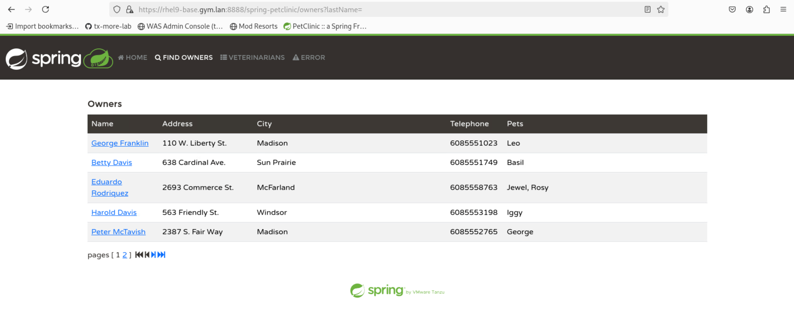

# Deploying a Spring Framework 6.x application

This section guides you through deploying a Spring Framework 6.x application running on Java 17, to a Liberty cluster managed by WebSphere Application Server using MoRE.

As with earlier tasks, you can choose to use either the graphical administrative console or a scripting-based approach.

## About the Spring PetClinic application

In this module, you’ll work with the Spring PetClinic application, a sample web application built with Spring Boot 3 and Spring Framework 6, both of which require Java 17 or higher. This version of the application uses the Jakarta EE 10 technologies introduced in Spring Framework 6. You can find the source code [here](https://github.com/spring-projects/spring-petclinic).

## Building the application WAR file

To deploy the Spring PetClinic application to WebSphere Application Server using MoRE, you need to convert it from a Spring Boot JAR-based project to a WAR-based deployment.

Spring Boot supports traditional WAR deployments for servlet containers like WebSphere Liberty. To learn more about traditional deployment in Spring Boot, refer to the [Spring Boot traditional deployment documentation](https://docs.spring.io/spring-boot/how-to/deployment/traditional-deployment.html).

1. Clone the Spring PetClinic repository:

   ```sh
   cd /home/techzone/Student/tx-more-lab/module2

   git clone https://github.com/spring-projects/spring-petclinic.git
   cd spring-petclinic
   ```

2. To make the Maven project to build `war` file, update the `pom.xml` file by running the following command:

   ```sh
   cp ../updated/pom.xml pom.xml
   ```

   Key changes made in the file to support WAR deployment include:

      * Added a [`<packaging>war</packaging>`](updated/pom.xml#L15) element after the application version declaration:

        ```xml
        <version>3.5.0-SNAPSHOT</version>
        <packaging>war</packaging>
        ```

      * Added the [`exec.mainClass`](updated/pom.xml#L40) property under the `<properties>` section:

        ```xml
        <properties>
            ...
            <exec.mainClass>org.springframework.samples.petclinic.PetClinicApplication</exec.mainClass>
        </properties>
        ```

      You can view the full updated file [here](updated/pom.xml).

3. To make the application to run in web container, update the `PetClinicApplication.java` file by running the following command:

   ```sh
   cp ../updated/PetClinicApplication.java src/main/java/org/springframework/samples/petclinic/PetClinicApplication.java
   ```

   Key changes made in the file include:

   * Added the following [`import`](updated/PetClinicApplication.java#L21-L22) statements:

      ```java
      import org.springframework.boot.builder.SpringApplicationBuilder;
      import org.springframework.boot.web.servlet.support.SpringBootServletInitializer;
      ```
      
   * Updated the `PetClinicApplication` class to extend [`SpringBootServletInitializer`](updated/PetClinicApplication.java#L32):

      ```java
      public class PetClinicApplication extends SpringBootServletInitializer {
      ```
   
   * Added the [`configure()`](updated/PetClinicApplication.java#L34-L37) method override:

      ```java
      @Override
      protected SpringApplicationBuilder configure(SpringApplicationBuilder application) {
          return application.sources(PetClinicApplication.class);
      }
      ```

   You can view the full updated file [here](updated/PetClinicApplication.java).

4. Run the following command to build the application WAR file:

   ```sh
   mvn clean package
   ```

   The WAR file `spring-petclinic-3.5.0-SNAPSHOT.war` is created in the project's `target` directory and will be used for deployment to the Liberty cluster.

## Option 1: Using the administrative console

This section walks you through deploying the application using the administrative console.

If you prefer to use a script, skip ahead to [Option 2: Using administrative scripting](#option-2-using-administrative-scripting).

### Installing the application WAR file

1. Launch the **WAS Admin Console** by selecting it from your browser bookmarks or navigating to the https://localhost:9043/ibm/console URL.

2. Go to **Applications** &rarr; **New Application** &rarr; <ins>New Enterprise Application</ins>.

3. In the installation panel:

   * Under **Path to new application**, select **Local file system** and choose the WAR file located at `/home/techzone/Student/tx-more-lab/module2/spring-petclinic/target/spring-petclinic-3.5.0-SNAPSHOT.war`
   * Set **Target Runtime Environment** to `WebSphere Liberty`
   
   Click **Next** and wait for the application to upload.

4. Choose **Fast Path** and click **Next**.

5. Leave **Step 1** unchanged and click **Next**.

6. On **Step 2**, map the application module:

   * Under **Cluster and servers**, select both `MLSCluster` and `webserver1` by holding **Shift** or dragging between options.

   * Check the box next to `spring-petclinic-3.5.0-SNAPSHOT.war` and click **Apply**.

   * Confirm that both `MLSCluster` and `webserver1` are now listed under the **Server** column for the `spring-petclinic-3.5.0-SNAPSHOT.war` module.
   
   Click **Next**.

7. On **Step 3**, choose `default_host` as the **Virtual host** for the `spring-petclinic-3.5.0-SNAPSHOT.war` module, then click **Next** to continue.

8. On **Step 4**, enter `/spring-petclinic` as the **Context Root**, then click **Next** to continue.

9. On **Step 5**, review the installation summary and click **Finish**.

10. After the installation completes, click <ins>Review</ins>. 
   
   Select **Synchronize changes with Nodes**, and click **Save**. Click **OK** when synchronization is complete.

### Generating and propagating the web server plug-in

1. Go to **Servers** &rarr; **Server Types** &rarr; **Web servers**.

2. Select `webserver1` and click **Generate Plug-in**.

3. Select `webserver1` again and click **Propagate Plug-in**.

After plug-in generation and propagation are complete, verify that the application is running by following the steps in [Checking out the application](#checking-out-the-application).

## Option 2: Using administrative scripting

This section walks you through deploying the application using the administrative console.

Run the following command to deploy the application using the provided Jython  script [`deployPetClinic.py`](deployPetClinic.py):

```sh
/home/techzone/IBM/WebSphere/AppServer/profiles/Dmgr01/bin/wsadmin.sh \
  -lang jython -user techzone -password IBMDem0s! \
  -f /home/techzone/Student/tx-more-lab/module2/deployPetClinic.py
```

The script performs the following actions:

* Installs the `spring-petclinic-3.5.0-SNAPSHOT.war` WAR file to the managed Liberty cluster `MLSCluster`
* Maps the application to both `MLSCluster` and `webserver1`
* Maps the application to the `default_host` virtual host
* Generates and propagates the web server plug-in configuration

After the script finishes, the message `PetClinic successfully deployed!` is displayed. Wait for a while to let the application to start. Verify that the application is running by following the steps in [Checking out the application](#checking-out-the-application).

## Checking out the application

Because the application is accessible via IHS, use the following URLs based on the connection type:
* **SSL (HTTPS):** https://localhost:8888/spring-petclinic/ _(also available in bookmarks as PetClinic)_
* **Non-SSL (HTTP):** http://localhost:7777/spring-petclinic/

To confirm the application is functioning correctly, launch it and navigate to the **FIND OWNERS** tab in the top menu bar. Click **Find Owner** without entering the search field. If successful, a list of existing owners should appear without any error messages.


